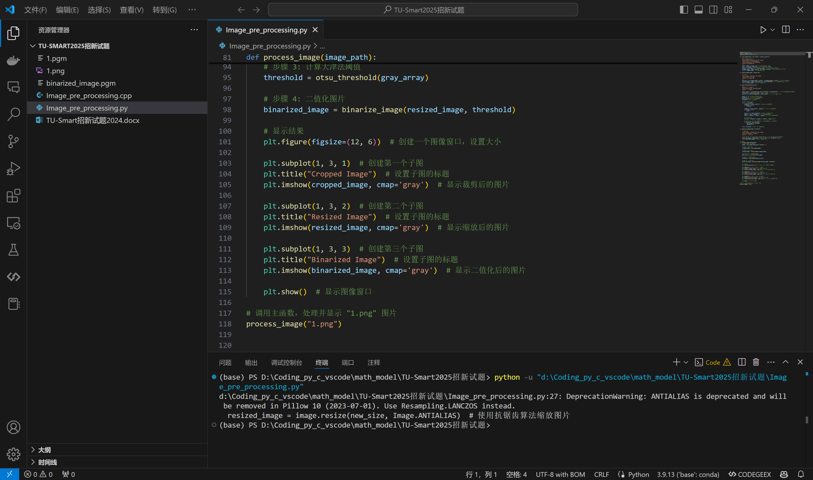
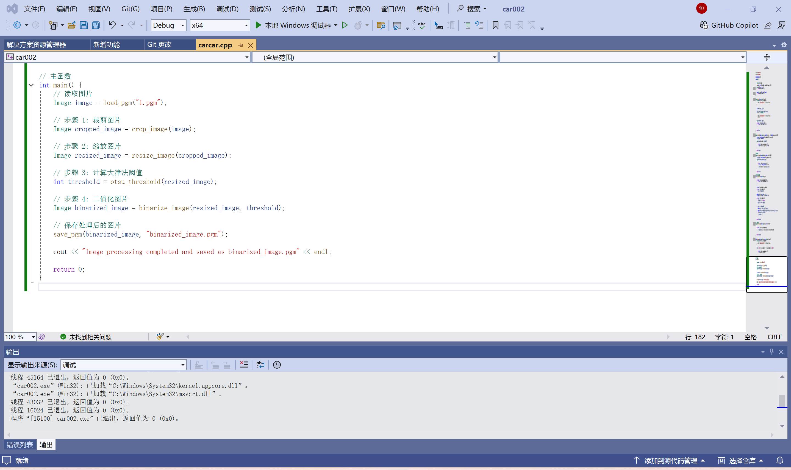

# TU-Smart2025-Recruitment
大家可以参考，但还请独立思考。由于更熟悉python，鄙人先完成了python代码，然后一点点肝出来了c++代码，说实话以前只用Dev C++写过基础的c语言，今天刚安装VS2022，算是开眼了。

### 项目名称：智能车竞赛图片预处理与二值化

---

### 项目简介

在智能车竞赛中，图像预处理是基础循迹与元素识别的关键步骤之一。摄像头作为主要传感器，用于捕捉赛道图像。由于摄像头捕捉的图像存在车头信息干扰以及远端赛道的变形，且单片机处理大尺寸图像的效率较低，因此需要对图像进行裁剪、缩放和二值化处理。

本项目通过C/C++和Python编程实现了对640x480像素灰度图像的预处理，主要包括裁剪、缩放和二值化操作，最终生成适合后续智能车循迹与识别算法的二值化图像。

---

### 项目要求

1. **裁剪图像**：移除图像中上下两端信息复杂、干扰较多的区域，仅保留中间的赛道部分。
2. **缩放图像**：将裁剪后的图像尺寸缩小至裁剪后尺寸的1/4。
3. **计算二值化阈值**：使用大津法（Otsu's Method）对缩小后的图像灰度值数组进行统计分析，确定二值化的最佳阈值。
4. **二值化处理**：根据计算出的阈值，对缩小后的图像进行二值化处理，生成仅包含黑白像素的图像。

---

### 代码实现

#### 1. Python 实现
要记得安装必备依赖，如果你更改了文件名称或者路径，记得自己调整。
```
    pip install Pillow matplotlib numpy
```

<div align=center>
 
</div>
运行成功，效果如下图
<div align=center>
 
</div>
**Python** 代码用于快速验证图像处理流程，具有可视化结果的功能。

#### 2. C++ 实现
在这里，推荐安装Visual Studio 2022，我一开始用的Dev C++，Dev还是太古老了，用Visual Studio 2022新建一个项目就好了。

**C++** 代码用于适配智能小车部署，符合命题要求。
<div align=center>
 
</div>
C++程序，我为了本地能很好地运行，使用了PGM格式的图像，你可以在[png转pgm](https://omnifile.co/zh-cn/to-pgm/)或者[万能格式转换](https://cdkm.com/cn/)，完成格式转换，但在这个Github项目上，我已经替大家完成了这一步。
